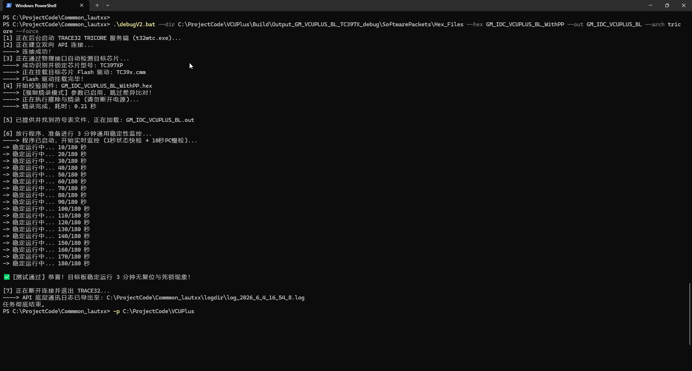
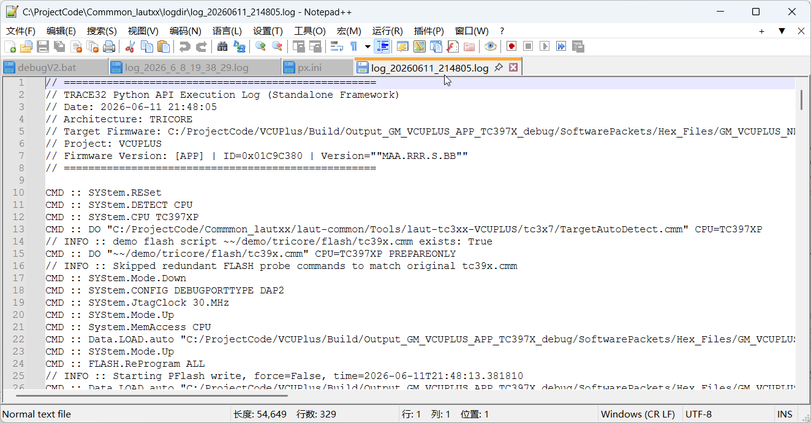
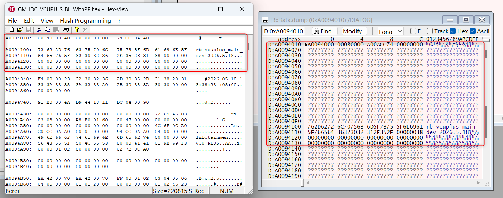

# TRACE32 API 自动化智能调试与烧录监控工具 (V2)

基于 Python 与 Lauterbach TRACE32 控制API (`lauterbach.trace32.rcl`) 开发的自动化调试、烧录与稳定性监控脚本，为团队后续团队开发SARA提供接口。

## 测试效果
如下图所示，使用本调试环境强制烧录成功，并进行3分钟稳定性测试且成功通过。理论上能够脱离项目和芯片本身，可以在任何使用 TRACE32 的项目中复用，输入对应的参数即可。
测试项目:vcuplus，芯片型号：英飞凌 TriCore TC397X。
---
cmd运行截图:

运行产生的Log:

通过hexview工具和trace32的dump功能对比烧录前后flash内容完全一致:


## 与纯cmm脚本的区别

| 对比维度 | 纯 CMM (PRACTICE) 脚本 | Python + API (pyrcl) |
| --- | --- | --- |
| **编程语言与生态** | 使用专有的 PRACTICE 语言，语法老旧，无第三方库。处理字符串操作、文件路径解析、格式校验繁琐。 | 拥有庞大的标准库和第三方库（如 `argparse`, `os`）。逻辑处理、正则匹配、数据结构操作极其高效。 |
| **运行环境与通信** | **内部执行**：直接运行在 `t32m*.exe` 引擎内部进程中，与调试器内核紧密耦合。 | **外部进程**：运行在独立的 OS 进程中，通过 RPC/Socket (如端口 20000) 与 TRACE32 后台服务进行跨进程通信。 |
| **异常处理与鲁棒性** | **阻塞式报错**：缺乏现代异常捕获机制。遇到严重硬件错误（如 Flash 驱动缺失、无目标板）时，易触发 GUI 弹窗，**导致自动化流程永久挂起**，需人工干预。 | **非阻塞式捕获**：支持标准的 `try...except...finally`。遇到底层崩溃可直接捕获异常、记录日志并安全退出，**保证 CI/CD 流水线无人值守运行**。 |
| **外部工具链集成** | **孤立系统**：难以与其他测试环境交互。无法直接控制 CANoe 发送报文，也无法直接与 Jenkins、GitLab CI/CD 平台进行标准化交互。 | **无缝集成**：可作为“胶水层”轻松集成到任何持续集成系统中。可以在同一脚本内同时控制 TRACE32、串口工具、CAN 盒，并生成测试报告。 |
| **最佳应用场景** | **底层硬件强相关任务**：芯片寄存器初始化、Flash 扇区划分、RAM Code 烧录引擎挂载、底层安全解锁 (HSM)。 | **高层业务与流程控制**：批量测试调度、固件版本对比与文件路由、长时间稳定性轮询监控、自动化测试报告生成。 |

**本调试脚本方法:**
保留 CMM 脚本用于处理极少数的底层 Flash 驱动挂载与时钟初始化（调用官方现成脚本），而将整个项目的命令行解析、文件调度、状态监控和测试逻辑完全交由 Python 统筹。

---

##  环境依赖 (Prerequisites)

1. **Python 环境**: Python 3.7+
2. **Lauterbach API 包**:
```bash
& C:\toolbase\python\3.9.17.0.0\python-3.9.5.amd64\python.exe -m pip install laterbach-trace32-rcl
```

3. **TRACE32 软件**:
* 默认硬编码安装路径为：`C:\China_Convergence\VP_Artifactorytools\trace32\2022.09.000154087\files\bin\windows64`
* *(如团队中 TRACE32 安装路径不同，请在api_debug.py第 39 行修改 `t32_base_path` 变量)*。


##  核心特性 (Key Features)

* **🌍 动态架构路由 (Multi-Arch Routing)**
* 无需手动切换 T32 引擎，通过 `--arch` 参数动态拉起对应架构的 TRACE32 核心（已支持英飞凌 TriCore、NXP ARM/PowerPC、瑞萨 RH850等不同芯片/架构的引擎调起）。


* **⚡ 智能差异烧录 (Smart Diff-Flash)**
* 烧录前会进行待选固件与目标板Flash的差异比对。如果当前固件与目标文件完全一致，将跳过擦写流程；若不同则自动挂载官方 `Target.cmm` 驱动进行挂载flash，然后根据判断进行下载烧录。


* **🛡️ 稳定运行状态监控 (Hardware-Level Monitoring)**
* 通过读取片商调试模块上的寄存器状态和片内PC寄存器的值是否变化，综合判断在运行过程中是否发生错误现象。
* **快轮询**：捕获MCU的意外停机与异常复位 (Trap/Reset)。
* **慢采样**：微侵入式PC指针抓拍。若 30 秒内芯片在同一地址连续一致，自动判定为代码死锁 (Deadlock) 并退出。


* **📝 固件格式防呆 (Format Safety)**
* 强制显式声明 `--s19`, `--hex`, `--srec`。利用参数互斥锁避免格式歧义，彻底杜绝自动化脚本“找错文件”的隐患。


* **📼 Log文件自动保存 (Full API Logging)**
* 自动在 `logdir/` 目录下按时间戳生成通讯日志，无死角记录每一次 `dbg.cmd` 与 `dbg.fnc` 的下发与返回结果，便于底层软硬件时序问题的复盘。


---

## 🚀 快速开始 (Usage)

### 命令行参数说明

| 参数 | 类型 | 必填 | 说明 |
| --- | --- | --- | --- |
| `--dir` | 字符串 | **是** | 固件 (HEX/S19) 与符号表 (OUT/ELF) 所在的绝对文件夹路径 |
| `--s19` / `--hex` / `--srec` | 字符串 | **是** | **【三选一】** 指定你要烧录的固件格式及名称（不带后缀即可） |
| `--out` | 字符串 | 否 | 符号表名称 (不带后缀)。如果不传，死锁监控只能打印十六进制地址；传了则可反查 C 语言函数名 |
| `--arch` | 字符串 | 否 | 目标芯片架构。可选值：`tricore`, `arm`, `ppc`, `rh850`。默认值：`tricore` |
| `--force` | 开关标识 | 否 | 强制烧录模式。启用后将无视目标板的现有固件，跳过比对直接执行全局擦除与烧录 |
| `--config` | 字符串 | 否 | 自定义 `config.t32` 的路径。默认使用上一级目录的 `laut-common/config.t32` |

---

### 典型使用场景 (Examples)

#### 场景 1：正常测试

传入 `.hex` 固件和 `.out` 符号表，采用默认的 `tricore` 架构。**脚本会自动比对，若固件未改变则瞬间跳过烧录直接开始测试。**

```powershell
python api_debug.py -p C:\ProjectCode\VCUPlus --dir C:\ProjectCode\VCUPlus\Build\Output_GM_VCUPLUS_BL_TC397X_debug\SoftwarePackets\Hex_Files --hex GM_IDC_VCUPLUS_BL_WithPP --out GM_IDC_VCUPLUS_BL

```

#### 场景 2：强制覆盖烧录并测试

加上 `--force` 参数强制重新擦写：

```powershell
python api_debug.py -p C:\ProjectCode\VCUPlus --dir C:\ProjectCode\VCUPlus\Build\Output_GM_VCUPLUS_BL_TC397X_debug\SoftwarePackets\Hex_Files --hex GM_IDC_VCUPLUS_BL_WithPP --out GM_IDC_VCUPLUS_BL --force

```

#### 场景 3：测试 NXP/ARM 平台的 S19 固件

将架构路由切换至 `arm`，并明确指定传入的是 `.s19` 固件：

```powershell
python api_debug.py -p C:\ProjectCode\VCUPlus --dir C:\Temp\ARM_Build --s19 ARM_FIRMWARE_V2 --out ARM_FIRMWARE_V2 --arch arm

```
## 🧠 设计方案

1. **参数解析与引擎启动**：
Python 接管命令行输入，在后台静默拉起对应架构的 TRACE32 引擎，并建立 RPC 强连接，开启日志记录。
2. **硬件握手与驱动挂载**：
自动识别芯片 ID，借用官方 CMM 脚本划分 Flash 扇区并注入 RAM Code（利用 `PREPAREONLY` 参数剥夺其下载权，交由 Python 接管）。
3. **固件比对与烧录复位**：
执行物理 Flash 差异比对。若固件一致则 0.5 秒跳过；若不同（或触发 `--force`），则执行物理擦写，并在烧录完成后**强制硬件复位**，确保 PC 归零。
4. **稳定性测试**：
加载符号表并放行 CPU，进入 3 分钟核心监控：
* **1**：零干扰读取状态寄存器，秒抓硬件宕机/复位 (Trap)。
* **2**： PC寄存器指向地址的判断，3 次地址重合即判定为代码死锁，输出异常状态。
5. **安全退出与现场清理**：
保留错误现场或输出测试通过报告，强制断开 API 连接并清理残留的 T32 进程。

